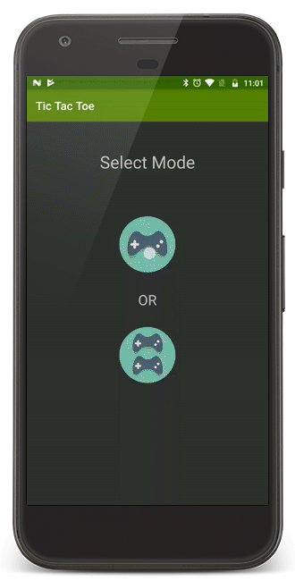

# Tic Tac Toe

### Overview
An unbeatable tic tac toe game.

The fact that a tic tac toe game will always draw if two "perfect players" are playing makes this game unbeatable. 

For the calculation of next move Min-Max algorithm is used.

 

 

### Project Details
+ The tic tac toe board is a single custom view supporting various animations like click and board clearing animations
+ There are three selection screens in which player mode, sign, and first turn can be selected

This was my first Android app :), but of course I keep modifying the code from time to time.
